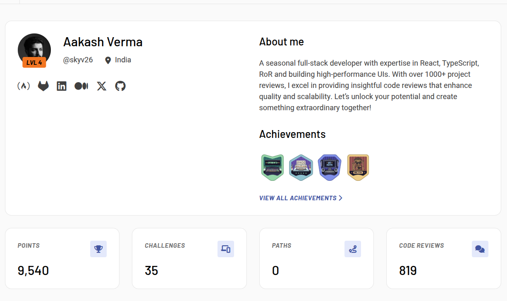
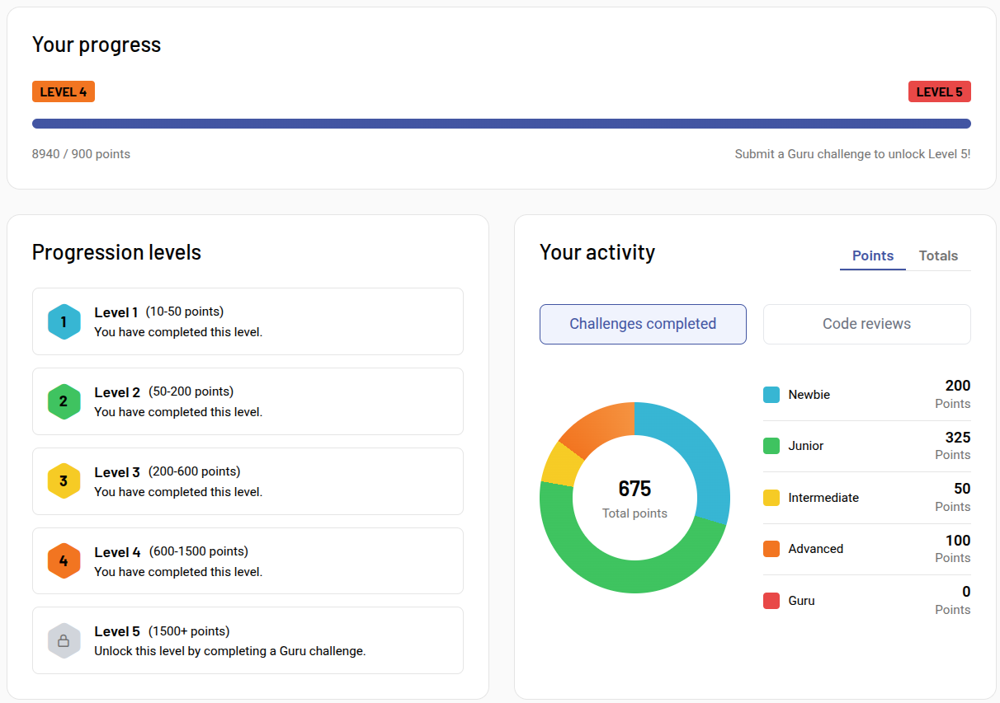
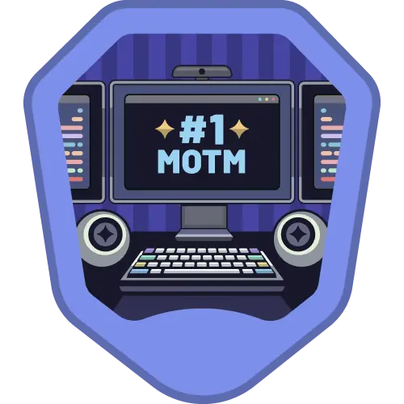
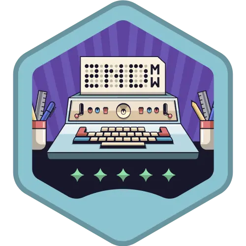
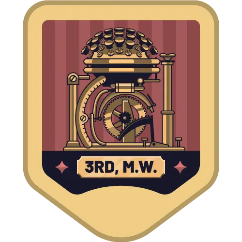
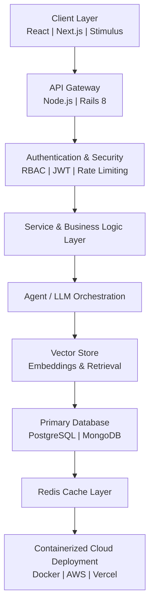

# Hi 👋, I'm **Aakash Verma** 🇮🇳

## 🚀 Software Engineer, Technical Consultant & Thought Leader

  

<h3 align="center">
AI Systems Engineer • Agentic AI Architect • Full-Stack Strategist • Tech Columnist • Product-Focused Consultant
</h3>

---

# 🧠 Executive Profile & Engineering Philosophy

I am a **Software Engineer and Technical Consultant** focused on architecting **AI-driven, scalable, production-grade systems**.

I treat software as a craft — engineered with clarity, resilience, and long-term maintainability.

> **"Expectations lead to disappointments."**  
> My Life's Philosophy

My work centers around the shift from passive AI tools to **Agentic Systems** — intelligent architectures that reason, plan, and act autonomously while remaining transparent, secure, and controllable.

---

# 🏆 Professional Impact & Leadership

  <table>
    <tr>
      <td>
         
        <strong>Frontend Mentor Performance</strong>
      </td>
      <td>
         
        <strong>Continuous Learning Velocity</strong>
      </td>
    </tr>
  </table>

| Category                | Measurable Impact                        |
| ----------------------- | ---------------------------------------- |
| 🌍 Global Collaboration | 100+ Developers Across Continents        |
| 🏆 Mentorship           | Top 40 Global Mentor                     |
| 🔍 Code Reviews         | **1000+** Professional Projects Reviewed |
| 🌱 Human Impact         | Helped 100+ Engineers Level Up           |
| 🚀 Production Systems   | 50+ Web Applications                     |
| ⚡ Embedded Solutions   | 10+ IoT & Hardware Systems               |
| 🗽 Open Source          | 5000+ Contributions                      |

---

# 🛠 Technical Spectrum

## 🤖 AI, Agentic Systems & Data Intelligence

- Agentic AI Workflows (Multi-step reasoning agents)
- Tool-use & Function Calling systems
- RAG Architecture & Retrieval Optimization
- Embedding Pipelines & Semantic Search
- Vector DBs (Pinecone, Weaviate, pgvector)
- OpenClaw experimentation & agent frameworks
- Hybrid LLM deployment (Local via Ollama + Cloud APIs)

---

## 🏗 Backend & Distributed Systems

- RESTful Microservices
- Event-driven architecture
- Service-layer abstraction
- Secure Authentication (RBAC, JWT)
- API Hardening & Rate Limiting
- Modular backend scaling strategies
- Database indexing & query optimization

---

## 🌐 Frontend Engineering & UX Systems

- SSR / ISR / Edge Optimization
- State Architecture Design
- PWA Implementation
- Bundle Optimization & Code Splitting
- Performance Profiling
- Component-driven UI systems
- Design-to-production pipelines

---

## ⚙️ IoT & Critical Engineering Systems

- Embedded C/C++ Firmware
- Sensor-to-Cloud Pipelines
- Real-time Monitoring Systems
- Hardware-to-API Integration
- Low-level optimization & memory control

---

## ☁ DevOps, Infrastructure & Scaling

- Dockerized microservices
- CI/CD automation pipelines
- AWS deployments & cost optimization
- Hybrid model serving
- Environment isolation & container orchestration
- Production monitoring strategies

---

# 🎖 Frontend Mentor Achievements

  
  
  
  

---

# 🏗 System Architecture Blueprint (AI SaaS Reference)

---

# 📈 Advanced Productivity Insights

<!-- Enhanced GitHub Stats -->

<!-- Donut Language Chart -->

  

<!-- Contribution Streak -->

  

<!-- Contribution Graph -->

  

<!-- Contribution Snake -->

---

# ✍️ Writing & Thought Leadership

_Exploring the intersection of human philosophy and engineering systems._

| Article                                                                                                                               | Central Theme                            |
| ------------------------------------------------------------------------------------------------------------------------------------- | ---------------------------------------- |
| [**The Clockmaker’s Dilemma**](https://skybrel.medium.com/the-clockmakers-dilemma-a-story-about-humans-in-the-age-of-ai-6133366a73fa) | Preserving humanity in automated systems |
| [**Friend or Foe?**](https://skybrel.medium.com/friend-or-foe-the-invisible-game-of-technology-c06987e6c2ac)                          | The hidden influence of technology       |
| [**The Happy Developer**](https://skybrel.medium.com/how-to-be-the-happiest-software-developer-bcae8a663ca6)                          | Sustainable engineering fulfillment      |

👉 **[Explore Full Medium Archive](https://skybrel.medium.com/)**

---

# 🤝 Consulting Philosophy

As a consultant, I focus on:

- Understanding business context before writing code
- Building scalable systems instead of short-term hacks
- Prioritizing long-term maintainability
- Designing AI responsibly
- Teaching while building

I don’t just deliver software — I deliver clarity, structure, and direction.

---

# 📫 Connect & Network

  
  
  
  
  

 

  

