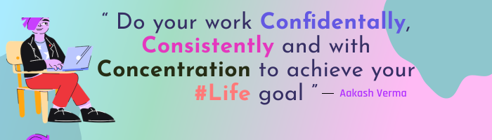

# Hi 👋, **I'm Aakash Verma (Software Engineer)** 🇮🇳 
 

 

**A dedicated software engineer based in India with 3 years of comprehensive experience in the IT industry. I specialize in both front-end and back-end development, and I'm passionate about building robust and user-friendly software solutions.**

## About Me

- **Overall ~3 years of experience combinely in IT 🖥️ and Electronics :electron: field.**
- **Specialize in full-stack web development with 2+ years in web technologies.**
- **Top 40 mentor 😎 on the [Frontend Mentor](https://www.frontendmentor.io/).**
- **Collaborated with more than 100+ software developers all around the world remotely 💻.**
- **Level 1 seller on the Fiverr freelancing platform with positive feedback 🟢 and 5 ⭐ rating.**
- **Completed 30+ front-end projects of all levels using the latest javascript technologies and deployed them all successfully on different platforms.**
- **Delivered 10+ IOT and electronics projects worldwide 🗺️**
- **4000+ contribution 🗽 on the Github**
- **Completed 500+ code 📊 reviews for full-stack web projects using Github's Feature.**

#### Let's Connect On:

## Skills

Here's a glimpse of the skills I bring to the table:

- **Front-End Technologies**: React.js (including Redux.js, Redux Thunk, and Redux/Toolkit), HTML5, Vanilla JS
- **Back-End Technologies**: Ruby on Rails, Node.js, Express.js, GraphQL, Apollo, Django (Beginner)
- **Deployment**: Render, Vercel, Netlify, Railway.app, Heroku
- **Programming Languages**: JavaScript, Ruby, Python, Embedded C/C++
- **Databases**: MySQL, PostgreSQL, MongoDB, MariaDB
- **Testing**: Jest, RSpec, Rubocop, Capybara
- **Bundle Technologies**: Vite, Webpack, Parcel
- **Styling**: Ant Design, TailwindCSS, Chakra-UI, styled-components, SASS/SCSS, Bootstrap, CSS3

## What I'm doing presently?

- 🔭 I’m currently working on full-stack projects using the React library on the front end and Ruby on Rails on the back end.
- 🌱 I’m currently learning SSR, PWA's and other popular CSS frameworks. 
- 👯 I’m looking to collaborate on **Open Source** and **IoT** projects. 
- 💬 Ask me *anything* about `Technology`
- 📫 <a href="mailto:dev.aakashv@gmail.com">Send an email</a> 
- 😄 Pronouns: He / Him
- ⚡ Fun fact: I love electronics and programming.

 
 

 
 

 
 

 
 
 

 

